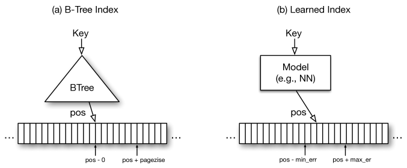
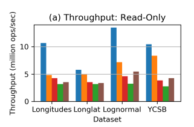
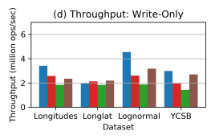
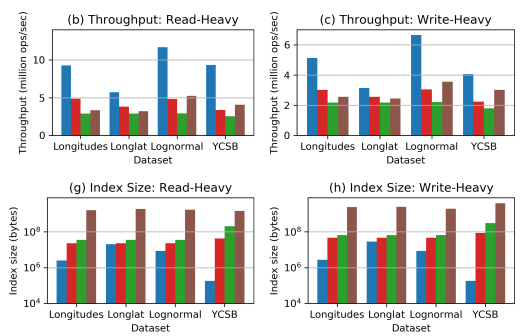
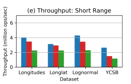
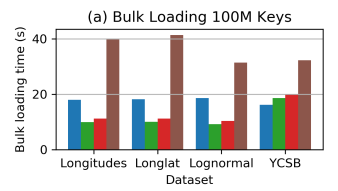

In this article, we have summarized the learning from the research paper titled “[ALEX: An Updatable Adaptive Learned Index](https://arxiv.org/pdf/1905.08898.pdf)” during our Independent Project at IIIT Delhi.

## Table of Contents
1. Introduction
2. Background
3. Alex Overview
4. Alex Algorithms
5. Experiments and Results
6. Conclusion
7. References

## Introduction
Learned indexes have proved to be 3 times faster than B+Tree for search queries and have less memory footprint.

ALEX is a dynamic data structure that supports inserts, updates, deletes, point lookups, short-range queries, and bulk loading.

## Background

### B+Trees
B+Trees are balanced trees that store pointers to the data in the leaf nodes. The lookup operation in a B+ tree involves reaching the leaf and searching for the key in the leaf. In most cases, binary search is used for searching in a node. B+Trees support insert, update and delete operations.

### Learned Indexes
Since ML models over the entire dataset are less accurate, learned indexes use **recursive model index(RMI)**. RMI follows a hierarchy of models and is similar to replacing the internal nodes of a B+Tree with ML models. The depth of the tree is drastically reduced. Prediction is done recursively where higher-level models predict lower models, which are trained on a subset of the data, and finally, the leaf model predicts the position. Often the RMI stores min and max error bounds for the models, and a binary search is performed to find the desired key. Each model in RMI can be different, usually, neural networks or linear regression are chosen as the root model. A drawback of the learned index is that it is not dynamic — does not support operations like insertion, updation, and deletion.

## ALEX Overview

### Design
1. Optimized storage layout — ALEX uses a Gapped Array that allows easier inserts and prevents shifting of keys for the task.
2. Model-based inserts allow a more accurate insertion of data and provide a better search performance.
3. ALEX uses exponential search. Exponential search is designed for unbounded lists and proves to be faster than binary search with bounds. This also eliminates the need of storing min and max error bounds in RMI.
4. ALEX uses adaptive expansion and node splitting mechanisms and selective retraining which makes it more accurate for skewed data. It adjusts the size dynamically.
5. The parameters do not require re-tuning for different datasets like traditional learned index and use a cost model to adjust the structure of RMI.

### Node Layout
ALEX has two types of nodes — Data nodes and internal nodes.
1. **Data nodes** — store linear regression model for mapping keys to positions and 2 gapped arrays — for keys and payloads. Apart from the gapped array ALEX also has a bit map which helps in querying faster and reduces space overhead.
2. **Internal nodes** — store linear regression model and an array containing child node pointers.

## ALEX Algorithms

### Lookup Query
ML models are used iteratively to predict the location in the pointers array to reach the next level till we reach the data node. The model is used to predict the position in the keys array and then the exponential search is performed to find the key position. The value is read from the payloads array, if the key is not found null is returned.

### Range Query
We perform a lookup to find the position of a key with a value greater than equal to the starting value and then keep scanning till we reach the end.

### Insertion In Non-Full Data Node
ML models are used to predict insertion position similar to lookup. An exponential search is performed if needed to insert the key in sorted order. If a gap is present in the insertion position the key is inserted else the keys are shifted to create a gap. Ths insertion time is O(log(n)).

### Insertion In Full Data Node
**Node fullness** — For full data nodes, ALEX uses expansions and splits. Unlike a B+Tree, a data node in ALEX does not need to be 100% full, ALEX has upper and lower density limits for the gapped array and when the upper limit is reached the node is described as a full data node.

**Node expansion** — For expanding data nodes, a gapped array is created with n/dl slots where n is the number of keys in the data node and dl is the lower density limit of the gapped array. The linear regression model is either retrained or scaled.

**Node split** —

**Cost Model**

1. Intra Node Cost Model — To decide between expansion and split linear cost models are used that take into account — 1) avg. exponential search iterations and 2) avg. shifts for insertions.
2. TraverseToLeaf Cost Model — To predict the time for traversing from root to data node. It uses — 1) depth of data node we are traversing to 2) total size of inner nodes & metadata in data nodes.

**Insertion Algorithm** —

Empirical cost is calculated from the exponential search iterations and shifts per insert. If the empirical cost does not deviate from the expected cost, the model is still considered accurate and we perform node expansion.

The models in the internal nodes of the RMI are not retrained or rescaled. Alex always splits the node in a power of 2 which was experimentally verified that the fanout of 2 is the best according to cost models in various cases.

### Deletion and Update Algorithms
The deletion is a simpler process than the insert here. A lookup query is done to find the location of the key and it is removed with the payload as well. It doesn’t degrade the model accuracy. The intra-node cost model is used to determine whether the nodes can be merged and upgraded to 1 level or not.

For update, a lookup query is made to find the location of the key and write a new value on the payload. Modifying the key is done by a combination of insert and delete algorithms.

### Bulk Load
The bulk load operation is very useful at initialization or for rebuilding the index. By using the cost model we build up the tree while making a decision whether the node can be an internal node or the leaf node. As the fanout is a power of 2, The keyspace is equally divided among the child nodes and then we recurse on its child node.

The main challenge is to decide the best fanout for each of the internal nodes while the RMI grows. A fanout tree helps us to determine the fanout value for each node. Fanout tree node is associated with the expected cost of constructing a data node over its keyspace, as predicted by the intra-node cost models. The covering set determines the optimal fanout for an RMI node as well as an optimal way to allocate the child pointers.

### Complexity Analysis
Within the data nodes, The exponential search is done in worst case O(log(m)), and in the best-case scenario, the data node model predicts the key position perfectly in O(1) complexity.

The insertion into a non-full node is first done by using a lookup query and the process of the shift is done to introduce the gaps. It is expected that all the queries can be done in O(log(m)) complexity in most of the cases but the worst-case complexity will be O(m). O(log(m)) complexity is achieved due to the gapped array that we are using. The best-case scenario will be the predicted position is correct and there is a gap at that place. So just by inserting the node will do the job and the time required will be O(1) which is a constant time.

## Experiments and Results
The following datasets were used in the experimental process with the ALEX -

- The longitudes dataset consists of the longitudes of locations around the world from Open Street Maps.
- The longlat dataset consists of compound keys that combine longitudes and latitudes from Open Street Maps by applying the transformation.
- The lognormal dataset having values generated according to the lognormal distribution.
- The YCSB dataset has values that are uniformly distributed across the full 64-bit domain and uses an 80-byte payload.

Five different kinds of experiments were performed which are the mixture of insert and read queries with varying percentages.

### 1. Read-Only Operations
In the read-only experiment where all the query was read-only, Alex performed somewhat similar to Learned Index but it outperformed in the lognormal and longitudes dataset. Also, Alex performed better in all the datasets than the traditional B+ Trees.

Also, the below plot of index size in all the datasets, Even when Alex has similar throughput as the Learned index but the index size is smaller. The reason is that Alex uses model-based insertion which helps in better predictive accuracy for each of the models.

### 2. Write Only Operations
Alex performed similar to other models in all the datasets for write operations but still a smaller index size which indicates that Alex takes a lesser amount of memory as compared to the other models and traditional index data structures.

### 3. Read and Write Operations
Almost in all the datasets, the Alex performed better in terms of less memory used or the index size. The Learned Index has inserted time orders of magnitude slower than Alex and B+Tree, so we do not include it in these benchmarks.

The relative performance advantage of Alex over baselines decreases as the workload skews more towards writes because all indexes must pay the cost of copying when splitting/expanding nodes. Copying has an especially big impact on YCSB, for which payloads are 80 bytes

On challenging models such as longlat, ALEX only achieves comparable write-only throughput to Model B+Tree and ART, but is still faster than B+Tree.

### 4. Range Query Operations
The Alex maintained its advantage over traditional B+ Trees on range workloads by maintaining a higher throughput and less index size.

But relatively the throughput is decreased if compared to the read and write operations experiment because the scan time starts dominating the overall query time and hence the faster lookup operations that Alex offers become less apparent.

### 5. Bulk Loading
Alex takes more time to bulk load than the traditional B+ Trees, but in YCSB dataset it takes lesser time to load compared to all the index data structures. Alex can quickly make up for its slower bulk loading time than B+Tree by having higher throughput performance.

## Conclusion
Alex effectively combines the core concepts used in the Learned Index data structure with proven storage and indexing techniques. The gapped array node layout uses model-based inserts and exponential search, combined with an adaptive RMI structure driven by simple cost models, to achieve high performance and low memory footprint on dynamic workloads.

The results have shown that Alex has outperformed traditional B-Trees across varies operations and offers very fast lookup queries. In fact in general it has performed better than the learned Index as well.

There still exist some problems with Alex regarding the performance in some cases, supporting secondary storage for larger datasets and new concurrency control techniques. More research work can be done in this field to increase the operability of Alex.

## References
1. Jialin Ding, Umar Farooq Minhas, Jia Yu, Chi Wang, Jaeyoung Do, Yinan Li, Hantian Zhang, Badrish Chandramouli, Johannes Gehrke, Donald Kossmann, David Lomet, and Tim Kraska. 2020. ALEX: An Updatable Adaptive Learned Index. In Proceedings of the 2020 ACM SIGMOD International Conference on Management of Data (SIGMOD ‘20). Association for Computing Machinery, New York, NY, USA, 969–984. DOI:https://doi.org/10.1145/3318464.3389711
