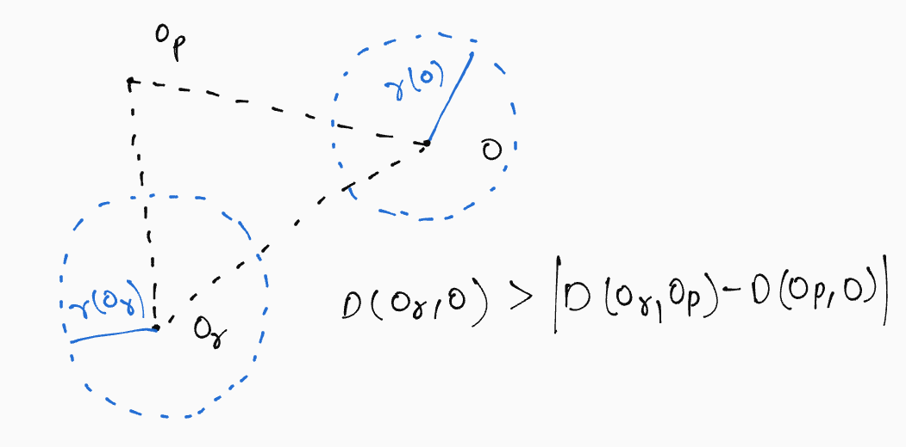

## 1. Similarity Searching
Similarity searching is used to search a large space of objects based on the similarity between a pair of objects. The similarity is compared using a distance metric satisfying the following properties:
1. Symmetry: 		D(Ox, Oy) = D(Oy, Ox)
2. Non Negativity: 	D(Ox, Oy) ≠ 0 and D(Ox, Ox) = 0
3. Triangle Inequality:	D(Ox, Oz) ≤ D(Ox, Oy) + D(Oy, Oz)

Where D is the distance metric and Ox, Oy, and Oz are three distinct objects.

Two popular similarity queries are range queries and K-nearest neighbors(K-NN):
1. **Range Query** - A range query retrieves objects within a radius r of the query object.
2. **K-Nearest Neighbors** - A KNN query retrieves the k-nearest objects of the query object.

## 2. B-Tree and B+Tree
A B-tree is a self-balancing tree-based data structure where each node consists of keys and data pointers. It has a search, insertion, and deletion time complexity of O(log(n)). The data in a B-tree is maintained in sorted order. There are no duplicate keys in a B-tree.

B+Trees are very similar to B-Trees, except that data pointers are only present in leaf nodes and not in internal nodes. Due to this, all nodes are present in the leaf and there is a duplication of keys. It also helps in faster search and easy deletion as all nodes are present at the leaf.

## 3. K-D Tree
A k-dimensional tree or K-D Tree partitions data in the k-dimensional space. It is like a binary tree with data at level L partitioned across plane L%k i.e the data points are partitioned (based on median) using planes chosen in cyclic order. For example, for a 2-D Tree, we have the root level partitioned across the x-axis, level 2 partitioned across the y-axis, level 3 across x, and so on alternately (have a look at the image below for more clarification).

Insertion and deletion take O(logn) time each in K-D Trees whereas the KNN query takes O(k*logn) time to find the k nearest neighbors.

## 4. M-Tree
M-trees consist of nodes and leaves and are similar to R+ trees. Each node is consist of a set of routing objects and a radius r which denotes the radius which covers all the data points in its subtree. 

The structure of the M-trees is as follows:
1. **Non-Leaf Nodes** - Consist of a set of routing objects and pointer to its parent nodes.
2. **Leaf Nodes** - Consist of a set of objects and pointer to its parent node.
3. **Routing Objects** - Consist of an object, covering radius, a pointer to its covering tree, and distance from its parent node.
4. **Object** - Consist of feature value, the object identifier, and distance from its parent node.

The covering radius is the radius that is the minimum distance from this node such that all nodes in its subtree are within this ball centered at the node having a radius equal to the covering radius.

Insert Operation: The algorithm of insertion first finds the correct position of the node to be added and after finding the position, If the node found is not full then this new node is added to the node else a split method is used which splits the node found efficiently and add this new node to the M-tree.

There are two types of queries that are performed on the d-dimensional data points:
1. **Range Queries:** Given a query object and distance r, the function returns all the nodes having a distance less than or equal to r from the querying object. The algorithm involves recursively going down the tree and neglecting the subtrees which cannot contain a candidate answer to our query. Moreover, the distance calculations for a higher dimension can cost more computation for which a check is used first, and then only distance computations are calculated. Experimental results have shown that it has saved 40% of the distance computations.

Looking at the check, let the querying object is O and the current routing object is Or. Then D(O, Or) > r(O) + r(Or) means we can simply prune this node and we won’t be able to find any candidate answers in its subtree. This is because the minimum distance between the closest point in the subtree of the current node should be D(O, Or) - r(Or) and this should be within r(O). Now using triangle inequality on D(O, Or), it gives us |D(Op, O) - D(Op, Or)| ≤ r(O) + r(Or) which is the check, Op denotes the parent object of the current node.

2. **K-NN Search:** The algorithm retrieves the k nearest neighbors of the querying object. The algorithm is quite similar to what has been done in R trees, It uses a priority queue and k element array which contains our final result. The priority queue consists of the pointers of all the active subtrees which can contain our candidate for the answer and a lower bound of distance is also maintained according to the pointer currently present in the priority queue. The bound is used to decide in which direction the tree can be pruned to narrow down the search over the tree. The algorithm again uses the check similar to the range query algorithm to cut down the distance computations.

The M-trees reduce the number of page reads and the distance computation by a significant factor and hence is suited for the higher-dimensional datasets.

## 5. Packed Memory Array(PMA)
Packed memory arrays are used to store elements in sorted order with gaps in between. The insertion and search complexities in PMA are O(log2n) each. Densities are calculated in a packed memory array using the formula occupancy divided by capacity.

Occupancy is given by the total occupied indices in PMA and capacity is the total size of PMA. We have minimum and maximum threshold values for density in PMA. If the density exceeds the maximum threshold value then we have to perform a node split operation. Similarly, if the density becomes less than the threshold value we perform a node merge operation. 

## 6. Gapped Array
Gapped arrays are array-based data structures very similar to PMA. The difference between PMA and gapped array is that in PMA gaps are uniformly spaced between the elements and rebalancing is done to maintain this uniform spacing. Based on the minimum and maximum density thresholds within a certain range of indices, we perform shifting in PMA. So gapped arrays are like PMA minus the rebalancing, which makes them simpler. The structure of a gapped array consisting of alternate keys and gaps is very helpful in dynamic updates.

## 7. Acknowledgment
We would like to express our gratitude to our supervisor, Dr. Bapi Chatterjee, for helping and guiding us throughout our project.

## 8. References
- Ciaccia, Paolo & Patella, Marco & Zezula, Pavel. (2001). M-tree: An Efficient Access Method for Similarity Search in Metric Spaces. International conference on very large data bases (VLDB).
