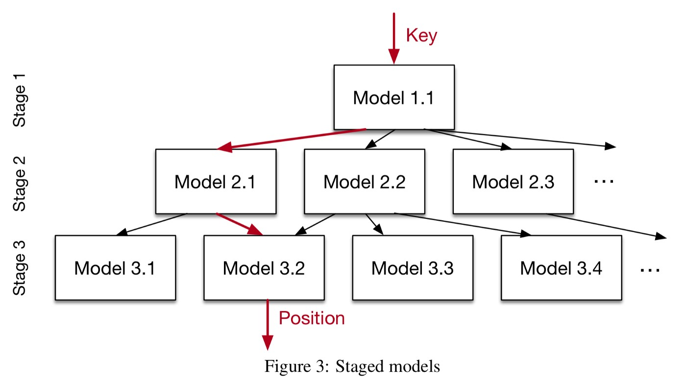
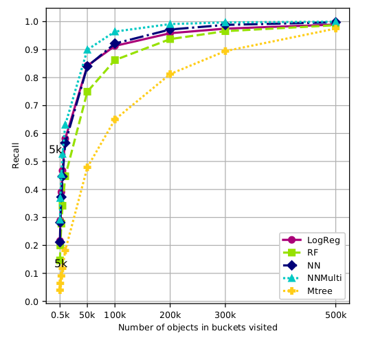
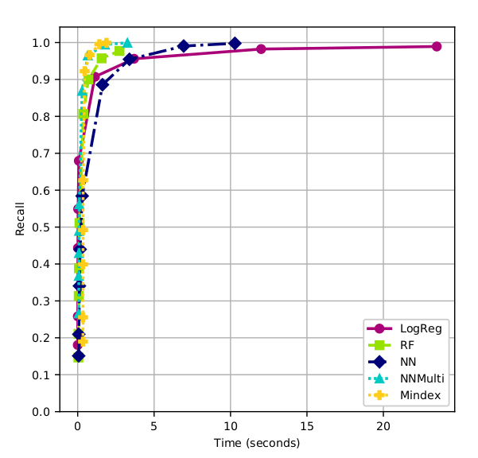
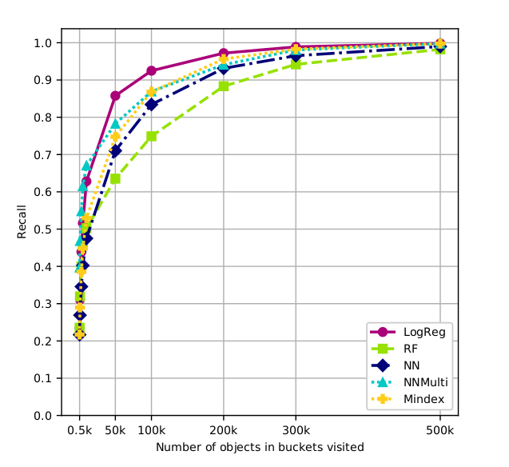
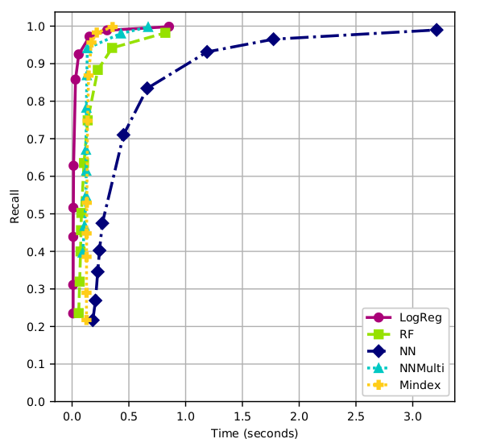
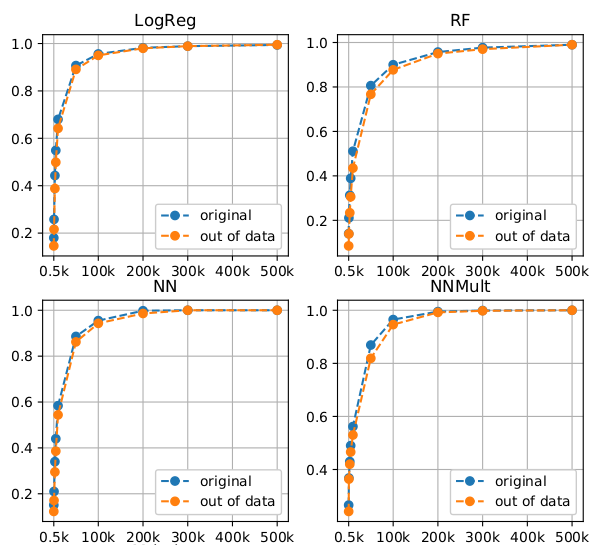
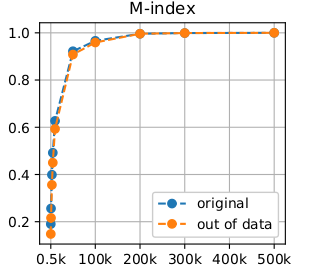

In this article, we have summarized the learning from the research paper titled "Implementation of Learned Metric Index" by Terézia Slanináková during our Independent Project at IIIT Delhi. The thesis discussed Learned Metric Index(LMI) for large-scale similarity searching and compared it to traditional structures like M-Tree and M-Index.

## Table of Contents
1. Motivation
2. Similarity Searching
3. Learned Metric Index(LMI)
4. Implementation Of LMI
5. Results
6. Conclusion
7. References

## Motivation
Searching a database collection is a crucial task. A database index helps in minimizing the disk accesses when processing a query and maps queries to database records. Traditionally, B-Trees were used for storing data.

### B-Tree
B-Tree is a balanced tree where each node consists of keys, with time complexity of search, insert and delete operations as O(log(n)). Though B-Trees are robust and can be used for a wide range of datasets, they are not the most efficient for all types of datasets and the ‘one data structure-fits-all’ approach often exhibits shortcomings. This is where machine learning comes into the picture. Training machine learning models for answering database queries has shown a lot of performance benefits.

### Learned Index Structures
Learned Index Structures maintain the structure of a B-Tree but replace all the internal nodes with machine learning models. Lookups are performed by narrowing the range of possible results and each model is trained on the narrow segment of data. This drastically improved the lookup time and the index size. Some of the drawbacks include a decrease in precision and recall as retrieval is not guaranteed and a large amount of training time is required for the machine learning models.

## Similarity Searching
Popular similarity queries are -
1. **range queries** — retrieves objects within a given radius r
2. **kNN** - returns k-nearest objects. Some of the popular index structures in the similarity searching domain are M-Tree and M-Index.

 ### M-Tree
M-Tree is often used as a baseline for developing new indexes. M-Tree is a **balanced tree** constructed recursively in a **bottom-up** manner by dividing the region into smaller parts enclosed by circles. The representative of each node is its pivot and covering radius i.e it divides the points in the R^n space using range query technique.

### M-Index
M-Index is constructed in a **top-down** manner, unlike M-tree, using Voronoi partitioning and priori selected pivots. The tree is often **unbalanced** as subtrees are formed by assigning objects to the nearest pivot recursively.

The number of distance computations in both the index structures is drastically high as they use the concepts of pivot objects and distances to pivots for searching.

## Learned Metric Index(LMI)
The LMI in this master's thesis focused only on search improvement and partitioned a given dataset into a tree-like structure for fast and accurate retrieval. The accuracy of retrieval acts as a performance measure for the LMI.

### Supervised training
The paper discussed a supervised approach where querying was performed over an existing index structure(the speed-recall tradeoff).

### Building LMI
The LMI was built by replacing each internal node with a learned model in a tree-index structure. These models are trained on subsections of data as we descend down.

### Searching LMI
Querying LMI was done using **approximate similarity search** that follows an early termination strategy and stops searching before exhausting the entire search space. A priority queue is used to rank models based on the probabilities of the classes.

### Performance Metric
Recall (TP/(TP+FN)) was chosen as the performance metric as we care only about finding relevant objects. This was calculated at the bucket level.

## Implementation of LMI
The implementation was done in python 3.6 and the code repository can be found below: [Code](https://gitlab.ics.muni.cz/445526/learned-indexes)

Machine Learning frameworks and libraries like Keras, Scikit-learn, Numpy, Pandas were used.

### Choosing Classifier
Experiments were performed by building LMI on a wide range of classifiers like Logistic Regression, Random Forests, kNN, Linear SVC, NN and CNN. Classifiers were chosen based on 3 parameters — training time, prediction time and accuracy of 30NN search.

1. Training Time — It was observed that KNN and SVC have larger training times, Logistic regression was the most efficient followed by NN, CNN and Random Forest.
2. Performance — In terms of recall, NN, CNN and Random Forest perform well.
Finally, logistic regression, fully-connected NN, fully connected NN with multilabel classification and random forests were selected after the experiments considering the speed-recall tradeoff.

### Space and Time Requirement
3 properties, the training time, prediction time and space occupancy were compared for the above models to understand how LMI behaves while changing the dataset size. It was observed that neural networks are more flexible with increasing data size whereas random forests are not able to adapt well and result in bigger trees.

### Hyperparameter search
Hyperparameter search was performed by training the LMI with a small set of values for each hyperparameter. The following hyperparameters` were chosen -

1. Number of epochs — Logistic Regression
2. Number of layers, neurons, and epochs — Neural network
3. Depth and number of estimators — Random Forest
4. Multilabel training for neural network

## Results
Two datasets — CoPhIR and Profiset were used for the experiments. In the preprocessing stage, standardization was performed. Performance on queries not present in training data was lower however for higher stopping conditions there was not much difference.

### For CoPhIR Dataset
M-Trees with 2-level and M-Index with 6-level were used for this dataset. The graph below shows the relation between recall and the number of objects in each bucket using 4 LMIs. From the graph, we can see that Multilabel Neural Network performed better than all other models as it has greater recall and less number of objects in the bucket visited.

The graph below shows the comparison of 4 LMI models and M-Index in terms of recall in proportion of time. The response time increases in the last ten seconds for higher ones. The running time of Logistic Regression is slightly higher.

### For Profiset Dataset
The graph below shows the comparison of 4 LMI models and M-Index(Left node capacity of 2000, 2 levels) in terms of recall to the number of objects in the visited bucket.

Logistic Regression performed really well with Profiset dataset while the Multilabel Neural Network model was the second-best choice. The graph below shows the comparison of 4 LMI models and M-Index in terms of recall in proportion to the time elapsed.

### Similarity Search Query
The graph below shows the comparison of average recall collected from running k-NN search on 1000 random queries from and out of the dataset at increasing stop conditions. As we can see all models performed badly on out of the dataset queries when compared to dataset queries. It seems that Neural Network models performed better than other models and looks like these models were not overtrained on the noise specific to the training data.

Let's analyze the performance of the M-Index model. The M-Index model also shows the loss just like other LMI models. All such results conclude that the LMI models were overtrained on the training data and were not very successful in learning the general trend in the data. However, the performance on the out of the dataset queries is not significantly worse. But this suggests that there is room for improvement in efficiently building the LMI models.

## Conclusion
Since using machine learning approach to M-Trees showed great results and helped in optimizing similarity search, there is a lot of scope of research in this field. One of the ideas that we can work on for future research is making the LMI dynamic. In this thesis, static LMI was built by training models beforehand and then querying it. The following ideas can be taken forward —
- Indexes based on unsupervised training
- Exploring the potential for reliable insert and delete operations
- Reducing the cost of building

The LMI has shown a clear dominance against the standard used M-trees and B-trees for indexing in database systems but some more improvements are required in the LMI’s before it can be properly used for large database systems.

## References
Slanináková, Terézia. (2021). Implementation of Learned Metric Index. 10.13140/RG.2.2.30135.24486.

